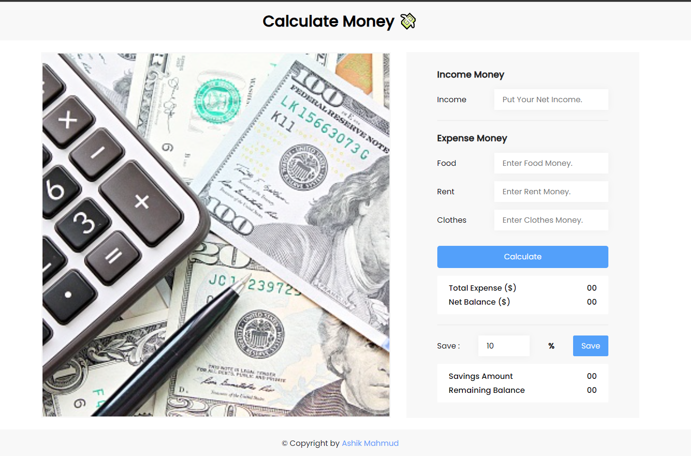

# Calculate Money Web Application

Hello broh!! this is simple calculate money application for assignment. So, If it has any problem of my project please feel free to mentioned me in the email. Thanks

# Using Technologies
~~~ 
- HTML5/HTML
- CSS3/CSS
- Vanilla JavaScript.
- DOM Manipulation
- VS Code Editor
- Github/Git bash
- Google Fonts(poppins)
- Image from unsplash
- Favicon from Icons8
and many more
~~~
## Can't share the live link because this is Assignment.

## Here is preview in this project

>Thanks for reach out me on Github.